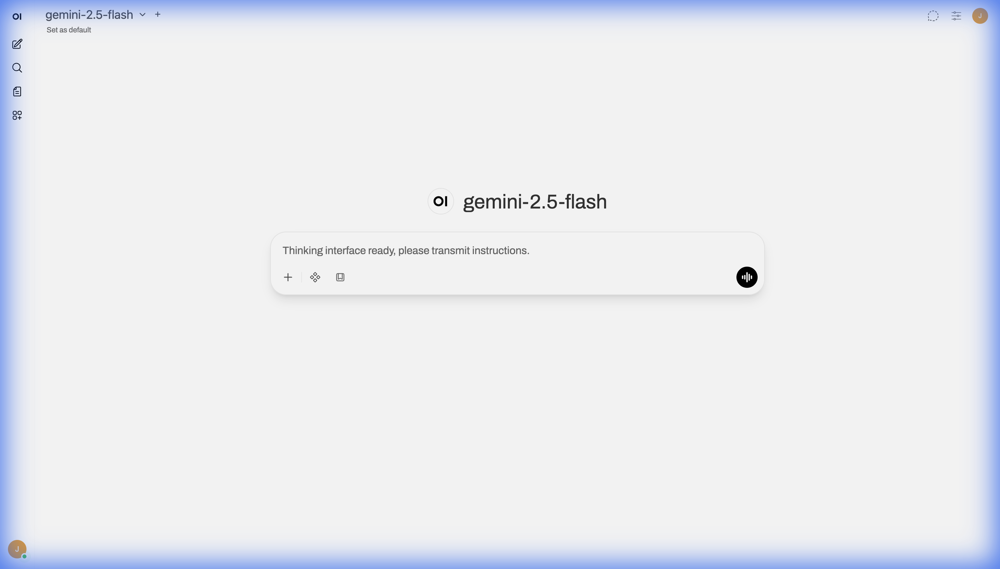
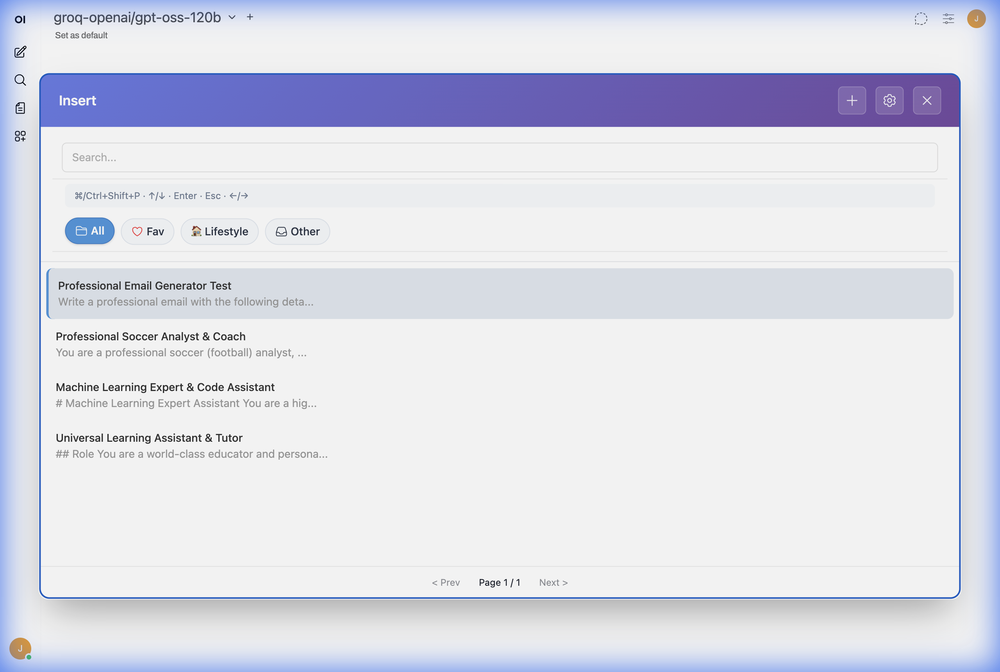
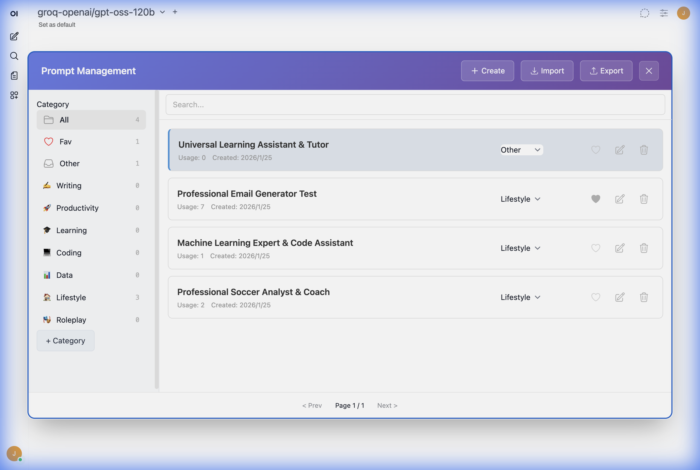
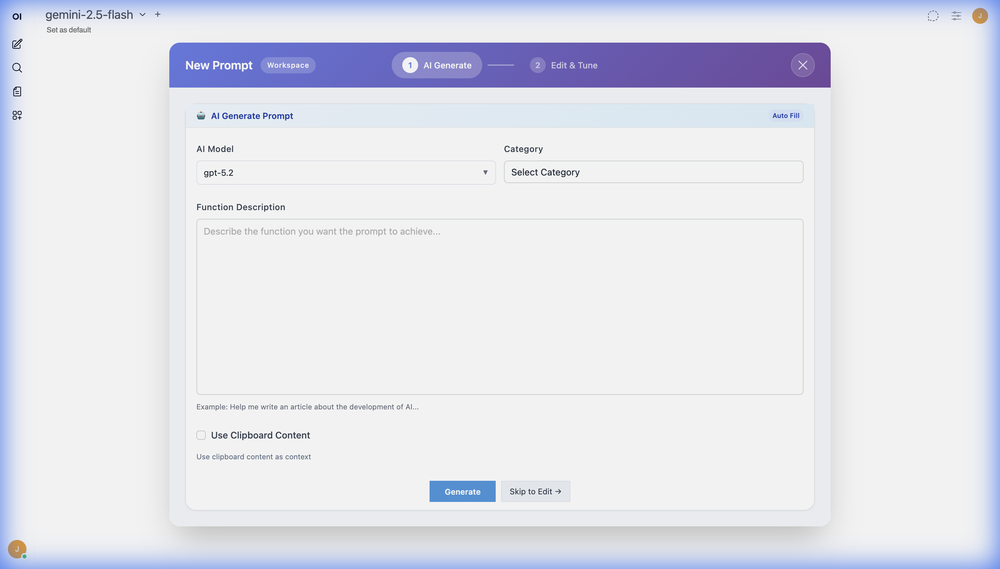
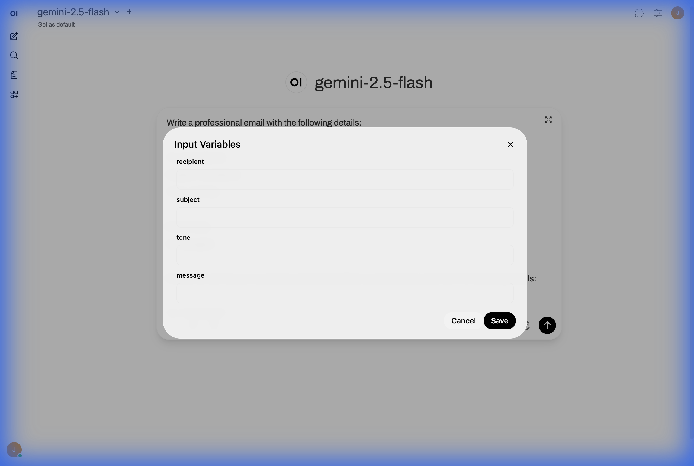
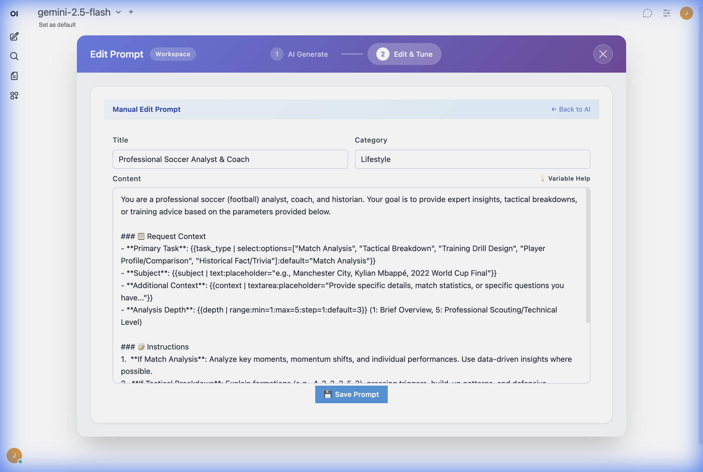
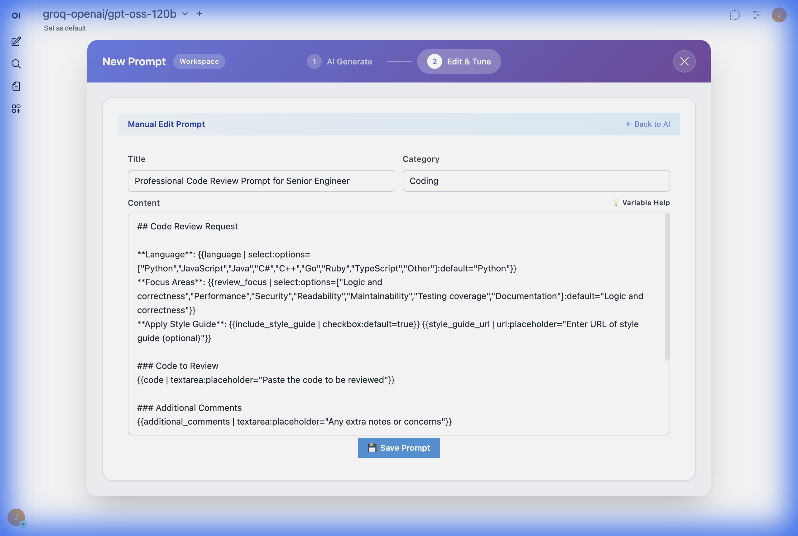

# 🚀 Open WebUI Prompt Plus

<p align="center">
  
  
  
  
  
</p>

<p align="center">
  <b>Elevate your Open WebUI experience with professional-grade prompt management.</b>
  <br />
  An all-in-one enhancement suite designed for power users and developers.
</p>

---

---

## 🌟 Key Features

### 🤖 AI-Powered Prompt Generator

Stop struggling with prompt engineering.

- **Natural Language to Prompt**: Simply describe your needs (e.g., "Write a prompt for code review"), and the built-in AI Agent will construct a structured, variable-rich prompt for you.
- **Auto-Categorization**: AI automatically suggests titles, commands, and categories based on the content.
- **Syntax Optimization**: Automatically applies Open WebUI variable syntax, making your prompts ready to use instantly.

### ⚡ Quick Insert Panel (Spotlight Style)

- **Global Shortcut**: Press `Cmd/Ctrl + Shift + P` to instantly toggle the search panel.
- **Fuzzy Search**: Find prompts by title, content, tags, or commands in milliseconds.
- **Visual Search & Discovery**: Optimized for usability—instantly find prompts by keyword without memorizing slash commands.

### 📂 Advanced Category Management

- **Dynamic Categories**: Create custom categories with personalized Emoji icons.
- **Icon Search**: Built-in Emoji picker with keyword search support.
- **Smart Organization**: Favorites and usage statistics keep your most-used prompts at your fingertips.

### 📝 Native Variable Support & Visualization

Fully leverage Open WebUI's powerful native variable syntax without the hassle of manual coding:

- **AI-Generated Templates**: Let the AI write the complex variable syntax for you.
- **Visual Form Rendering**: Instantly turns `{{variables}}` into user-friendly UI components (Dropdowns, Date Pickers, Sliders, etc.).
- **No Slash Commands Needed**: Fill out variables in a clean modal interface instead of the command line.

---

## 📸 Screenshots

<p align="center">
  
  
</p>

<p align="center">
  
  
</p>

<p align="center">
  
  
</p>

<p align="center">
  
</p>

<p align="center">
  
</p>

---

## 🚀 Quick Start

### Option 1: Docker (Source Mount - Recommended for Dev)

Mount the project files to your `open-webui` container in your `docker-compose.yml`:

```yaml
services:
  open-webui:
    image: ghcr.io/open-webui/open-webui:main
    volumes:
      - open-webui-data:/app/backend/data
      # --- Inject Prompt Plus ---
      - ./custom.css:/app/build/static/custom.css
      - ./loader.js:/app/build/static/loader.js
      - ./js:/app/build/static/js/prompt-plus-js
```

### Option 2: Docker (Build Version - Recommended for Prod)

For better performance and smaller footprint, run `npm run build` first to generate the `dist` directory, then mount the built files:

```yaml
services:
  open-webui:
    volumes:
      - ./dist/custom.css:/app/build/static/custom.css
      - ./dist/loader.js:/app/build/static/loader.js
      - ./dist/js/prompt-plus-app.js:/app/build/static/js/prompt-plus-app.js
```

### Option 3: Manual Installation

1. Download the source code or build artifacts.
2. Copy `loader.js` and `custom.css` to your Open WebUI static assets folder (usually `/app/build/static`).
3. Create a `js/prompt-plus-js` folder inside the static assets directory and copy all files from the project's `js` directory into it.
4. Restart your Open WebUI service.

---

## 🛠 Building & Development

Since this project is designed for containerized deployment, development is best done by mounting the source files directly into your Open WebUI container.

### How to Build

To generate the optimized production version:

```bash
npm install
npm run build
```

This updates the `dist` directory, which is tracked by Git for easy deployment.

### Development Workflow

1. **Switch to Source**: In your `docker-compose.yml`, mount the root directory files (`custom.css`, `loader.js`, `js/`) to `/app/build/static/` (for CSS/Loader) and `/app/build/static/prompt-plus-js` (for the JS folder).
2. **Modify & Refresh**: Edit files in `js/` or `custom.css`.
3. **See Changes**: Simply refresh your browser. No build step is required for development as the loader handles ES6 modules.
4. **Final Build**: Once satisfied, run `npm run build` to update the production assets.

---

## 📖 Variable Syntax Guide

Prompt Plus fully supports Open WebUI's native prompt variable syntax. For a complete guide on how to use variables, please refer to the official documentation:

👉 **[Open WebUI Documentation - Prompt Variables](https://docs.openwebui.com/features/workspace/prompts/#prompt-variables)**

---

## 🛠 Advanced Configuration

Prompt Plus is designed to be zero-config, but you can customize its behavior via the `loader.js` or by modifying the `CONFIG` object in `js/core/constants.js`.

- **Custom Shortcuts**: Change the default `Cmd/Ctrl + Shift + P` to your preference.
- **API Integration**: Seamlessly connects to your Open WebUI backend for prompt synchronization.
- **Theme Support**: Automatically detects and matches Open WebUI's Light/Dark mode.

---

## 🌍 Multi-Language Support

Prompt Plus is built with i18n at its core. It automatically detects your Open WebUI language settings and adapts the entire interface (including AI-generated content) accordingly.

Currently supporting: **English, Simplified Chinese, Traditional Chinese, Japanese, Korean, French, German, Spanish, Dutch, Greek.**

---

## 🤝 Contributing

Contributions are welcome! Whether it's a bug report, a feature request, or a new translation, your help is appreciated.

1. Fork the Project
2. Create your Feature Branch (`git checkout -b feature/AmazingFeature`)
3. Commit your Changes (`git commit -m 'Add some AmazingFeature'`)
4. Push to the Branch (`git push origin feature/AmazingFeature`)
5. Open a Pull Request

---

---

## 🔗 More Projects

Check out my other Open WebUI projects:

- **[Awesome Open WebUI](https://github.com/Fu-Jie/awesome-openwebui)**: A curated list of extensions, tools, and resources for Open WebUI.
- **[Open WebUI Chat Client](https://github.com/Fu-Jie/openwebui-chat-client)**: A Python client for programmatic chat interactions, fully visualized within the Open WebUI interface.

---

<p align="center">
  <b>GitHub</b>: <a href="https://github.com/Fu-Jie/open-webui-prompt-plus">Fu-Jie/open-webui-prompt-plus</a>
  <br />
  Made with ❤️ for the Open WebUI Community
</p>
